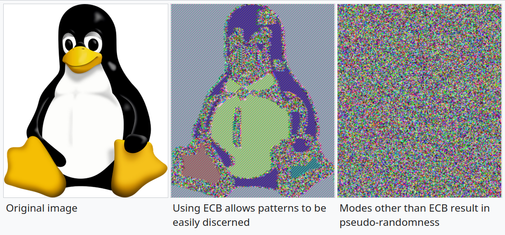

# Block cipher modes of operation

## Introduction
Since studying block ciphers like AES and DES in the classroom, we neglegted the fact that they can only take a specific size of input to encrypt. Upon learning this, we immediately thought "well what should we do if we had a longer message or maybe a shorter one?", then immediately came to think about the classic first solution to go ahead about it: keep encrypting blocks of data until you reach the last block, and pad it to fill any remainings. What we've just described is ECB (Electronic code block) Mode. The simplest (and weakest, as we will see later) block cipher mode of operation.

After doing a little bit more research into the topic, we've discovered that there exist many modes of operation; ie. methods that make a plaintext of numerous blocks in size fit into an encryption cipher that only operates on a single block. These modes can be split into two groups: modes that (on their own) only provide confidentiality, others also provide authenticity.

<!-- etc....say a bunch more stuff here -->

We have also learnt through research that block cipher modes are the weak link in the implementation of block cipher algorithmes like AES, not the algorithm itself. AES is considered to be very secure and the best (classical) attempt we have so far only managed to reduce the key size by a couple of bits (in the case of AES-128), with quantum implementations only cutting the key length by half (using AES-256 therefore becomes equivalent to using AES-128). But in this case, it's not the core block cipher algorithm that is the feasible target, it's more the way we use to make the plaintext suitable for processing with the block cipher. These block cipher modes of operation remain the most prone to vulnerabilities and exploits of inner workings, and therefore undermine the security of the block cipher algorithm.

### Padding
We will be using PKCS#7 to pad plaintexts to fit the block size. It consists of bytes that are added to the plaintext to fill up the last block so that it is the same size as the other blocks. The value of each added byte is equal to the number of bytes added. For example, if one byte is added, then its value is 0x01; if two bytes are added, then their values are 0x02 0x02, and so on. The beauty of this padding scheme is that the receiver (supposing the padding is valid) only needs to look at the last byte and remove that much bytes to get the intended plaintext.

### Well known block cipher modes of operation
We attempt to explain the inner workings of some of the most well known modes of operation:
#### ECB
ECB (Electronic Codebook) mode is a block-based encryption algorithm that divides the plaintext message into blocks of a fixed size and encrypts each block independently using the same encryption key. The ciphertext blocks generated by the encryption process are then concatenated to produce the final ciphertext. ECB mode does not introduce any randomness or dependencies between blocks, which makes it vulnerable to certain attacks, including replay attacks and frequency analysis attacks.
ECB mode is parallelizable for both encryption and decryption, meaning that multiple blocks can be encrypted or decrypted simultaneously, without needing to wait for the previous block to complete. This property makes it pretty efficient and reduces processing times. ECB mode also allows for random read access -- the ability to access any block of ciphertext directly, without needing to decrypt the previous blocks in the message -- as each block is encrypted independently.

#### CBC
CBC (Cipher Block Chaining) mode, on the other hand, introduces an additional level of randomness and interdependence between blocks. In CBC mode, the plaintext message is XORed with the previous ciphertext block before being encrypted. This process is repeated for each block in the message, with the first block being XORed with a random initialization vector (IV). CBC is more secure than ECB because identical plaintext blocks will not produce identical ciphertext blocks, as each block depends on the previous block's ciphertext. CBC is parallelizable for encryption but not for decryption, it also doesn't provide random read access: in order to decrypt a block, we need the previous block.

#### OFB
OFB (Output Feedback) mode is a special type of block cipher mode of operation, because it turns the block cipher into a stream cipher. Consequently, it eliminates the need for padding schemes, and produces a ciphertext the length of the original message. OFB generates a keystream of random bits, which is then XORed with the plaintext to produce the ciphertext. The first keystream block is generated independently of the plaintext by encrypting a fixed initialization vector (IV) with the encryption key. This keystream block is also fed back into the encryption process to generate the next keystream block, which is used to encrypt the second plaintext block, and so on.
One advantage of OFB mode is that it is a self-synchronizing cipher, meaning that errors in transmission or encryption do not propagate to affect other parts of the message. This is because the keystream is generated independently of the plaintext and is not affected by errors in the transmission of the ciphertext. Another advantage of OFB mode is that it allows for random read access, which means that any block of ciphertext can be decrypted without requiring the previous blocks. This is because the keystream is generated independently of the plaintext, and each block of the keystream is only dependent on the encryption key and the IV. However, one potential weakness of OFB mode is that if the keystream is ever reused with the same IV and encryption key, then an attacker can recover the plaintext by XORing the ciphertext with the keystream. Therefore, it is essential to use a unique IV for each encryption, and to ensure that the IV is not reused with the same encryption key.

#### CTR
CTR (Counter) mode works like OFB: it turns a block cipher into a stream cipher. But instead of using an IV to introduce randomness, it generates the next keystream block by encrypting successive values of a concatentation between a nonce and a counter. A nonce can be thought of just like an IV: a sequence of random bytes with a size half of the block size, the other half is filled with encrements of the counter.


One important feature of both the CTR and the OFB modes is that the encryption function is in itself the decryption function. No need to implement two separate algorithms, since they're basically just XORing a keystream with the plaintext to produce ciphertext or vice-versa.


## Attack

For demonstrating attacks, and because of the difficulty of the implementation of these attacks, we've only chosen to concentrate on four different attacks on two block cipher modes of operation: ECB and CBC.

### Encryption Oracle
An encryption oracle is just a function which can tell us something about a given input we feed to it. It ususally returns information in the form of a boolean value (true/false), this in return provides us with information to let us carry on our attack.

### Feasibility of Chosen Plaintext Attacks (CPA)
Chosen plaintext attacks is a cryptanalysis model which presumes that the attacker can obtain the ciphertext for arbitrary plaintext; he basically has control over (part of) the plaintext that's being encrypted. We start by revealing why this assumption isn't that far fetched, since we will be demonstrating some attacks based on it later. A pretty demonstrating example of this is the web pages we use today that run on plenty of javascript. Having the target redirected to a website owned by the attacker for example could lead to the website injecting some malicious javascript code that, while having limited capabilities, might still have the ability to perform a CPA.

### Detecting the Block Size
We have to start gathering as much informations as we can on the plaintext, the first and easiest thing to start with would be the block size. And to know that, we will use a simple scheme which consists of providing longer and longer input to the encryption function until anther block is added. Then we just calculate the difference in length to get the block size used in the encryption oracle.

### ECB
#### Detecting ECB Mode
An example function which can do this is present in the source code:
```rust
pub fn ebc_cbc_detection_oracle<T: AsRef<[u8]>>(ciphertext: T, block_size: usize) -> Mode {
    let ciphertext = ciphertext.as_ref().to_vec();
    let similar_blocks = count_similar_blocks(ciphertext, block_size);
    return if similar_blocks > 0 {
        Mode::ECB
    } else {
        Mode::CBC
    }
}
```
`count_similar_blocks` is a function that simply counts similar blocks. It's actually much simpler: it's only counting repeating blocks so there's actually no concrete measure of similarity here. As we've already seen, when ECB is injected with plaintext that contains two identical blocks, it will yeild the same blocks identical in ciphertext. That is a problem when it comes to cryptography because it reveals a lot about the plaintext, which is unacceptable.

There's a running saying in the cryptography community; which is that ECB lets you _see the penguin_, which is literally that, derived from a famous photo of the Linux Tux encrypted with ECB vs the same photo encrypted with another block cipher mode like CBC.



#### Attack 1: ECB Cut and Paste - A Replay attack
To explain this attack, we will imagine a scenario in which we have a chosen plaintext attack over a client that communicates with a server securely using AES-128.

The CPA capability we have here manifests itself as the ability to inject arbitrary input into a cookie (for example), that input is then sanitized by the client before being added as a value on the cookie, for it to be encrypted with AES_ECB_128 and then sent to the server. Our only hope then of bypassing the input sanitization imposed by the client is to crack the cryptography on the wire (we suppose we have access to the channel and we can listen on the _(encrypted)_ communication.

When the encrypted cookie reaches the server, the server decrypts it using the symmetric key. Then, it parses the key-value pairs on the cookie to recover a specific critical field (we must note here that we dont have direct write access to this field on the client side.)

The goal of this simulation will be to demonstrate how would we go ahead about changing the critical field using only cryptography and without direct access to the field from the controlled input.

The client implementation takes in an input email, and sanitizes it from any '=' or '&' characters, it then encodes it into the form `email=<input email>&uid=<generated uid>&role=<role>` before encrypting it with AES_ECB_128 and sending it to the server. For the unprivileged user, we have `role=user` and `role=admin` for a user with high privileges. The goal of this attack is to have the client send the server the data with `role=admin` so we our user can have higher privileges on the server. Again we can't just do this by enjecting `email@example.com&role=admin` into the input field, because the client will clean up the '&' and '=' characters and we suppose we have no other way of bypassing this. So the only way left would be to attack the cryptography behind this: we exploit the weakness of ECB and try to craft blocks and combine and resend them to eventually have the intended payload when the server decrypts it. Evidently, we suppose we can listen in on the channel between the client and server and intercept and modify messages.

For the details, we input for example "AAAAAAAAAAadmin" padded to 26 length, it then becomes
```
email=AAAAAAAAAAadmin[  padding ]&uid=10&role=admin
                |  we intercept | 
                |   and save    |
                |  this  block  |
```
The padding signifies padding of the block to 26 using PKCS#7 ie. padding 'admin' to 16. the block captured is a perfectly padded block that should come in the end of the intended payload.
Now we have to capture the first part; for this we have x characters to play with depending on the uid field.
```
email=abc@email.com&uid=10&admin=user[  padding   ]
       1        |       2        |       3        |
```
or:
```
email=abcabc@verylongemaildomain.com&uid=10&admin=user[  padding   ]
       1        |       2        |       3        |       4        |
```
etc...

We then replace the last block with our specially crafted block that we captured earliter to get the intended payload and then send it to the server, when it gets decrypted we find:
```
email=abc@email.com&uid=10&admin=admin[  padding  ]
       1        |       2        |       3        |
```

Below is the part of the code that performs this attack:
```rust
pub fn perform_ecb_cut_and_paste() {
    // client(input_email) == encrypt(profile_for(input_email)) -> cipher
    //      server(cipher) == check_admin(parsing_routing(decrypt(cipher)))
    let cipher = Cipher::new();
    let ciphertext = client(
        &cipher,
        &std::str::from_utf8(&crate::aes::pkcs_7_padding("AAAAAAAAAAadmin", 26))
                            .unwrap(),
        // the 26 is put there to get the padding at exactly 16 so i can get a
        // good encrypted block of the admin padded to 16
    );
    // client sending to server, intercepting...
    let intercepted_ciphertext = ciphertext;
    // crafting input
    let admin_block = intercepted_ciphertext.chunks(16).nth(1).unwrap().to_vec();
    let ciphertext = client(&cipher, "abc@gmail.com");
    let first_block = ciphertext
        .chunks(16)
        .take(2)
        .flatten()
        .map(|x| *x)
        .collect::<Vec<u8>>();
    let payload = vec![first_block, admin_block]
        .into_iter()
        .flatten()
        .collect();
    let result = server(&cipher, payload);
    println!("admin role = {result}");
}
```
The profile_for is a client side function that sanitizes input from malicious characters and appends the additional info to output the formatted text under the key-value format. Wheras parsing_routine is server side and does quite the opposite: parses and deconstructs the decrypted cipher. check_admin checks if the user has admin privileges.

#### Attack 2: Byte at a time ECB decryption: an ECB Chosen Plaintext Attack
This attack really shows the weakness of ECB. The setup for this demonstration is like this: suppose we have a 'partial' chosen plaintext attack, meaning we only control part of the plaintext, which gets mixed up with another unkonwn secret, and gets encrypted and sent through a channel which we can sniff on. The other secret here is modeled with a secret string which gets appended to our input. Because the encryption is done using AES_ECB_128, we can use the properties of ECB to decrypt it. As we've already seen, the same plaintext block yeilds the same ciphertext block when encrypted, it's independed of other blocks. And since our input is exactly next to the secret we want to decrypt, we can play with the input to maybe reveal characters; specifically, we can initially feed input that is exaclty one byte short of the block size, and that makes the first byte of the appended text part of the ciphertext block of our input, then we can just bruteforce it by trying every possible character (256 tries). In practice, we provide a random string (that we encode in base64 for obsecurity purposes) that gets appended to the input before encryption.
```rust
pub fn crack_a_block(oracle: &Oracle, block_size: usize) -> Vec<u8> {
    let mut cracked_bytes: Vec<u8> = Vec::new();
    // for as long as the secret string
    for byte in 0..oracle.encrypt("").len() {
        let chunk_index = byte / block_size;
        let block: Vec<u8> = 
            (0..(chunk_index + 1) * block_size - 1 - cracked_bytes.len())
            .map(|_| 65_u8) // ascii('A') is 65, 65_u8, then, is the byte 'A'
            .collect::<Vec<u8>>();
        let cipherblocks_to_compare_with = oracle.encrypt(&block)
            [chunk_index * block_size..(chunk_index + 1) * block_size]
            .to_vec();
        for i in 0..=255_u8 {
            if cipherblocks_to_compare_with
                == oracle.encrypt(
                    vec![block.clone(), cracked_bytes.clone(), vec![i]]
                        .into_iter()
                        .flatten()
                        .collect::<Vec<u8>>(),
                )[chunk_index * block_size..(chunk_index + 1) * block_size]
                    .to_vec()
            {
                cracked_bytes.push(i);
                break;
            }
        }
    }
    cracked_bytes
}

pub fn demo() {
    let secret_string =
"YSB2ZXJ5IHNlY3JldCBtZXNzYWdlIHRoYXQgc2hvdWxkbnQgYmUgZGVjcnlwdGVkIGV2ZW4gdGhvdWdoIHdlIGFwcGVuZCB1c2VyIGlucHV0IHRvIGl0";
    let oracle = Oracle::new(16, secret_string);
    let block_size = 16;
    println!(
        "{}",
        String::from_utf8(crack_a_block(&oracle, block_size)).unwrap()
    );
}
```
This code is equivalent to going through every character and appending it to 'AAAAAAAAAAAAAAA' (length: 15) to get a 16 byte block with every possible character, and then comparing them to the block accquired by providing only 'AAAAAAAAAAAAAAA' (length: 15) as input, meaning that the 16th byte will be the first byte of the secret string. We apply the same scheme technique to get the second third and every other byte of the secret string.

### CBC
#### Attack 1: CBC Bitflipping Attacks
With CBC, we always have to think about two blocks at a time, because of the way it works. To decrypt a block, we need the block that comes before it in the ciphertext. We are going to exploit this the other way around, and corrupt the previous block in the ciphertext before sending it to the server for decryption, to try and exploit it.

To see how this attack can pose problems, let's suppose we have access to a client that lets us send certain strings to a server but not every character is allowed, exaclty like the case with ECB Cut and paste, except this time the client and server are using AES_CBC_128.

To exploit it in this case we can just use a property of CBC, which is that it XORs resulting block from AES decryption with the ciphertext block before it to get the plaintext block, that means that if we flip a bit in a ciphertext block, the bit in the same position of the next *plaintext* block will also be flipped, because, again, they get XORed together.

We can use this to smuggle characters and bitflip them later on the communication channel in order to get back the desired characters.

For demonstration purposes, suppose we <!-- TODO -->


#### Attack 2: Padding Oracle Attacks

### History of these attacks in the TLS implementations
#### BEAST
#### POODLE


## References
